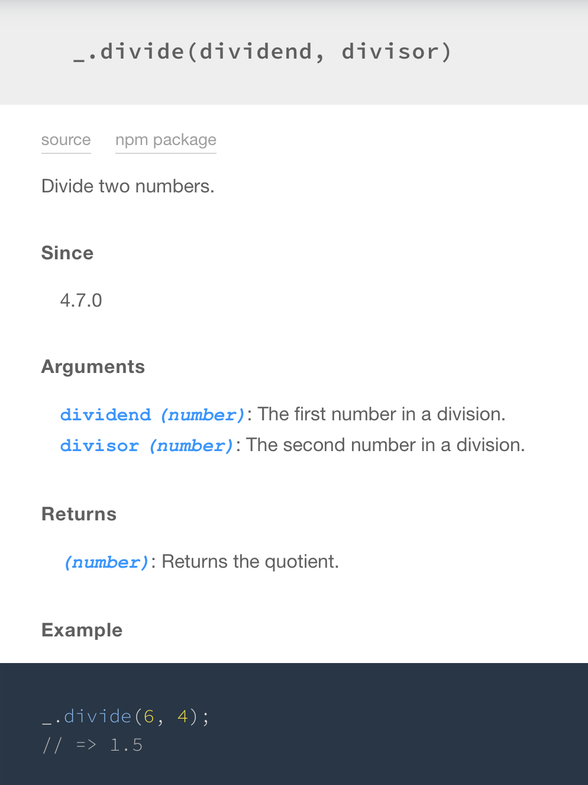

## Auto-Generated Documentation

Documentation is super important and will probably make the difference between a project's success and failure.  But it's also a real pain to write specs for all of your functions, and to keep those specs up-to-date as your code changes is even worse.

Thankfully developers are lazy and have written outstanding tools that help us with exactly this problem.  These tools allow you to generate documentation for your code by writing structured comments in each file, then running your code through a parser that can turn your comments into beautiful documentation.  Like in Lodash. 

This:

```js
import createMathOperation from './.internal/createMathOperation.js'

/**
 * Divide two numbers.
 *
 * @since 4.7.0
 * @category Math
 * @param {number} dividend The first number in a division.
 * @param {number} divisor The second number in a division.
 * @returns {number} Returns the quotient.
 * @example
 *
 * divide(6, 4)
 * // => 1.5
 */
const divide = createMathOperation((dividend, divisor) => dividend / divisor, 1)

export default divide
```

Becomes this: 



___

### Resources

For documenting JS code:
* [ESdoc](https://esdoc.org)
* [JSdoc](http://usejsdoc.org)

For API's & Express:
* [APIdoc](https://blog.jscrambler.com/documenting-apis-using-apidoc-js/)
* [express-api-docs](https://github.com/howardabrams/express-api-docs)

For publishing your docs:
* [Documentation.js](https://github.com/documentationjs/documentation)
* [Doxdox](https://doxdox.org)


___
___
### <a href="http://elewa.education/blog" target="_blank"></a>